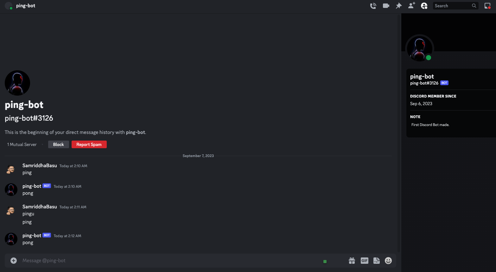
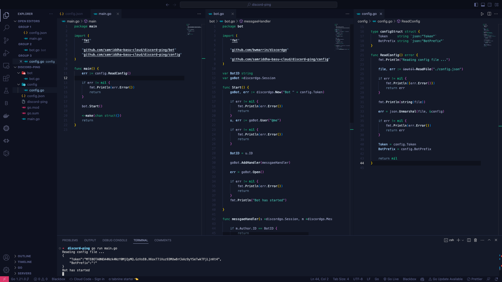

# Discord Ping Bot :ping_pong:
<div align="center">

[](https://golang.org/doc/go1.18)   
[](https://pkg.go.dev/github.com/bwmarrin/discordgo@v0.27.1)


</div>

<p align="center">
  
  
  <br />
   A simple Discord bot written in Go that responds to messages containing "ping" with "pong." Customize its prefix and token effortlessly! 

</p>


---

## Project Overview

This project is a basic example of creating a Discord bot using Go. It demonstrates how to set up a bot, read configurations, and respond to messages on the Discord platform.

## How to Use

### Clone the Repository

```bash
git clone https://github.com/samriddha-basu-cloud/Discord-ping-bot-using-Go.git
```

### Setup Using Go Get and Go Mod Tidy

1. Navigate to the project directory:
   ```bash
   cd Discord-ping-bot-using-Go
   ```

2. Install dependencies and tidy the Go module:
   ```bash
   go get "github.com/bwmarrin/discordgo"  
   go mod tidy
   ```

### Build the Project

Compile the bot and start it:
```bash
go build
./Discord-ping-bot-using-Go
```

### Contribution Guidelines

Contributions are welcome! If you'd like to contribute to this project, please follow these steps:

1. Fork the repository.
2. Create a new branch for your changes:
   ```bash
   git checkout -b feature/your-feature-name
   ```

3. Make your changes and commit them:
   ```bash
   git commit -m "Add your commit message here"
   ```

4. Push your changes to your forked repository:
   ```bash
   git push origin feature/your-feature-name
   ```

5. Open a pull request on the original repository.

## License

This project does not have a license. Feel free to it as you see fit.

---


